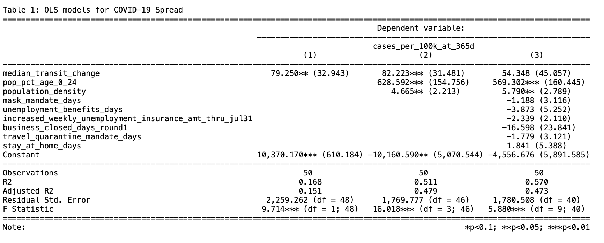

```{r setup, include=FALSE}
knitr::opts_chunk$set(echo = TRUE)
```


```{r load packages, echo=FALSE, warning=FALSE, message=FALSE}
rm(list = ls())
library(dplyr)
library(ggplot2) 
library(purrr)
library(haven)
library(tidyverse)
# install.packages("DescTools")
library(DescTools)
library(magrittr)
library(kableExtra)
require(plotrix)
# install.packages("magick")
# install.packages("webshot")
library("magick")
library("webshot")
# webshot::install_phantomjs()

#install.packages("openxlsx") 
library(openxlsx)
#install.packages("readxl")
library(readxl)
#nstall.packages("rapportools")
library(rapportools)
#install.packages("data.table")
library(data.table)

library(patchwork)
library(sandwich)
library(lmtest)

#install.packages("corrplot")
#install.packages("psych")
library(corrplot)
library(psych)
library(stargazer)
library(car)

#install.packages("kableExtra")
library(kableExtra)
```

# Introduction
 
As of the writing of the document, the COVID-19 coronavirus (COVID-19) has been spreading throughout the United States for nearly 14-15 months, with the initial cases identified as having entered the country in January 2020. This report uses data from the United States Census Bureau (including [state level demographics](https://data.census.gov/cedsci/table?q=ACS&g=0100000US.04000.001&tid=ACSDP1Y2019.DP05&moe=false&hidePreview=true) and county level [population](https://www.census.gov/data/datasets/time-series/demo/popest/2010s-counties-total.html#par_textimage_70769902) and [population density](https://www.census.gov/library/publications/2001/compendia/ccdb00.html) data), the [New York Times](https://raw.githubusercontent.com/nytimes/covid-19-data/master/us-states.csv) for COVID-19 case counts,  a [Google dataset](https://www.google.com/covid19/mobility/) on state-level mobility data, and related [COVID-19 policy data](https://docs.google.com/spreadsheets/d/1zu9qEWI8PsOI_i8nI_S29HDGHlIp2lfVMsGxpQ5tvAQ/edit?usp=sharing) from the US State Policy Database. All data used in the project was pulled in on April 10th, 2021.

Our team’s primary research question was “How does mobility impact the spread of COVID-19?” To begin to answer that question, our research team decided to conduct an exploratory observational analysis using OLS regression to measure the complex relationships that exist between changes in a states’ population mobility and state-level COVID-19 case counts per 100K people in the 365 days following each state’s declaration of a state of emergency (SOE). As part of this endeavor, we also explore whether other variables, such as state age demographics, population density, and state level policies on mask mandates, stay at home orders, quarantine restrictions, enhanced unemployment benefits, and business closures might also have an impact on COVID case counts.

This research question was initially motivated as an attempt to understand if the preventive measures that states have enacted in response to the pandemic were associated with statistically significant changes in case counts. Initially, we had hoped to find a causal relationship between mobility and COVID case counts. However, we ultimately decided against this because of the high likelihood of  reverse causality between these variables (i.e. a change in mobility causes a change in case counts which in turn will cause a change in mobility). Additionally, given how complex the nature of pandemics are, there was a strong possibility for omitted variable bias (such as state level differences in temperature and humidity, behavioral differences in terms of mask compliance, COVID testing availability, the percentage and absolute numbers of people using mass transit, and the percentage and absolute numbers of people who are able to work from home, to name a few). These omitted variables will be discussed in the model limitations section of this report.
We decided to focus on COVID cases as our dependent variable, as opposed to COVID deaths, because we inferred that COVID deaths counts are directly dependent on the number of COVID cases and other causal inputs, such as genetic predisposition, underlying health conditions/comorbidities, hospital utilization rates, the availability of various treatment options (ventilators, experimental drugs, etc.). Given COVID cases are a direct input to COVID deaths and much of the data needed to analyze these supplemental variables is not easily available or likely does not exist, a study on COVID death counts may suffer from substantial omitted variable bias. This would raise questions about the interpretation of our model in terms of both statistical and practical significance. 

Our motivation for normalizing the dependent variable per 100K people 365 days after each state’s declaration of a state of emergency was as follows: 

* Absolute population counts vary substantially from state to state, and population being the most important factor in absolute COVID case counts is not an interesting finding.

* One year was a natural ending point given that we recently passed the one year mark for each state’s declaration of a state of emergency. Additionally, we believe that the mere act of the state declaring an emergency may have contributed to shifts in the behaviors of the residents of each state, so we wanted to index our analysis against that moment in time.

We decided to regress on population mobility as our key variable of interest because: 

* Mobility fits well into a causal regression framework for COVID cases, because physical proximity is a requirement for disease transmission, and proximity is a function of mobility (and population density, which we will also explore in our modeling efforts). 

* The mobility data captures the actual effects of multiple correlated policies intended to reduce COVID transmission (such as stay-at-home orders, quarantine requirements after traveling or possible exposure to a person who tested positive, business and school closures, etc.). This is effectively a method of dimensionality reduction that contributes to model parsimony.


# Feature Selection for OLS Regression

For this study, we aggregated the different data sources across their individual study horizons (in most cases, more than one year) to generate a small sample of 50 state-level observations. The table below summarizes the features we analyzed for our descriptive OLS regression models to understand their association with the dependent variable (i.e. case count per 100,000 people): 

| Feature | Present in Which Model | Source |
|:-----------------|:----|:------|
| Mobility (% change)   | 1, 2, 3  | Google Dataset |
| Population Density (People/sq. mi.) | 1, 2, 3  | US Census Data |
| Percent of Population Under the Age of 25 (%)  | 2, 3   | US Policy Database |
| Mask Mandate Days | 2, 3 | US Policy Database |
| Unemployment Benefit Days | 3 | US Policy Database |
| Increased Weekly Unemployment Insurance Amount Through July 31 | 3 | US Policy Database |
| Business Close To Open Days | 3 | US Policy Database |
| Travel Quarantine Mandate Days | 3 | US Policy Database |
| Stay at Home Days | 3 | US Policy Database |

`Case Count Per 100,000 people`: This is our outcome variable, operationalized as discussed in the introduction. We decided to normalize the case counts around the population as we were concerned that a OLS regression absolute case count would not result in any meaningful association discoveries. 

`Mobility (% Change)`: We decided to regress on population mobility because physical proximity is a requirement for disease transmission and because mobility data captures the actual effects of multiple correlated policies intended to reduce COVID transmission (such as stay-at-home orders, quarantine requirements after traveling or possible exposure to a person who tested positive, business closures, etc.). This is effectively a method of dimensionality reduction that contributes to model parsimony. This Google dataset we used tracks the changes in mobility for the following sectors: (1) Grocery and Pharmacy, (2) Parks, (3) Residential, (4) Retail and Recreation, (5) Transit Stations, and (6) Workplaces. Ultimately, we decided to use the percent change in transit mobility in our models for two primary reasons (described in detail later). Firstly, most of the other mobility features are highly correlated with transit. Secondly, we couldn’t determine a method for aggregating these features into a statewide change in mobility data as the raw data was captured in percent changes and not absolute changes. We theorized that changes in transit station mobility would be the most associated with changes in case counts from this list as transit stations are often identified as major spreaders of disease.

`Population Density (People/sq. mi.)`: Normalized the state’s population by its area (given in square miles).

`Percent of Population Living in a High Population Density County (%)`: While normalizing a state’s case count by the population is useful, we decided to add an additional feature illustrating what percentage of the population lives in a high density county, which we defined as the top 50 counties in the state when ranked by county population per square mile. An illustrative example of why we added this feature can be seen in the state of New York, which was one of the earliest states to be plagued with the virus. According to the New York Times COVID-19 tracking database, New York City alone has had 882K of New York’s 1.94M (45%) total cases since the beginning of the pandemic (as of April 10th, 2021).

`Percent of Population Under the Age of 25 (%)`: The media and research studies alike have suggested that young adults and children are less likely to be impacted by the virus or may be asymptomatic compared with older adults. As a result, this young age group is more likely to continue spreading COVID-19. We hope to uncover a relationship between a state’s percentage of the population with young people and a corresponding change in case counts.

`Mask Mandate`: the number of days that a state had a mask mandate.

Other model 3 policy features: We selected the following policy-related features from the COVID-19 US State Policy Database (www.tinyurl.com/statepolicies) that we thought related to COVID cases including, the date the state of emergency declared, length of mask mandate, length of stay-at-home orders, length of business closure, length of travel quarantine mandate, length of increased unemployment benefits, and increased unemployment insurance amount. All the policy-related features were recorded as dates, except for the increased unemployment insurance amount that was recorded as integers. Ultimately, what we were interested in was the total days a given policy was active for during the one year period after a state of emergency was announced for each state.


# Initial Data Loading and Cleaning

First, we read in the NYT COVID database from an excel workbook (see the data folder in our repository for all of the raw data files used in this analysis). 

```{r read in NYT covid data, echo=FALSE, warning=FALSE, message=FALSE}


## Pull data from NYT COVID Database and plot summary
NYT_Data <- fread("https://raw.githubusercontent.com/nytimes/covid-19-data/master/us-states.csv")
#summary(NYT_Data)

## Convert date strings to dates. 
NYT_Data[,date:=as.Date(date)]
#summary(NYT_Data)

## Calculate cases on a time interval
start.date <- as.Date("2021-01-01")
end.date <- as.Date("2021-02-28")

interval.cases <- NYT_Data %>%
  arrange(state, date) %>% 
#          date == start.date) %>%
  group_by(state) %>%
  mutate(cases_inc = cases - lag(cases),
         deaths_inc = deaths - lag(deaths)) %>%
  ungroup() %>% 
  filter(cases_inc >= 0)

```

Then, we read in the policy data from an excel workbook downloaded from the US State Policy Database.

```{r read in policy data script, echo=FALSE, message=FALSE, warning=FALSE}
tab_names <- excel_sheets(path = "data/US_Covid_Policy_data.xlsx")

list_all <- lapply(tab_names, 
                   function(x) read_excel(path = "data/US_Covid_Policy_data.xlsx", 
                                                     sheet = x))
#Rename list elements
names(list_all) <- tab_names %>% 
    tolower() %>%
    gsub(pattern = "_", replacement = " ") %>% 
    str_to_title() %>%
    gsub(pattern = " ", replacement = ".") 

#Rename colums in the DF
for (df in 1:length(list_all)){
  name_qc <- names(list_all)[df] 
  #print(name_qc)
  if(name_qc %in% c("Stay.At.Home", "Unemployment.Benefits")){
    names(list_all[[df]]) <- list_all[[df]][1,]
    list_all[[df]] <- list_all[[df]][-1,]
  }
  
  names(list_all[[df]]) <- gsub(" ", "_", names(list_all[[df]]) %>% tolower())
}

# names(list_all$Stay.At.Home) <- list_all$Stay.At.Home[1,]
# list_all$Stay.At.Home <- list_all$Stay.At.Home[-1,]


#Join the separate sheets into one master sheet
policy_df_0 <- list_all$State.Characteristics %>%
  select(state, state_abbreviation, state_fips_code,
         population = population_2018,
         area_sq_mi = square_miles,
         population_density = population_density_per_square_mile) %>%
  left_join(list_all$State.Of.Emergency %>%
              select(state, 
                     state_of_emergency_declared = state_of_emergency_issued),
            by = "state") %>%
  left_join(list_all$Masks %>%
              select(state, begin_mask_mandate = public_face_mask_mandate, 
                     end_face_mask_mandate),
            by = "state") %>%
  mutate(begin_mask_mandate = as.Date(begin_mask_mandate, 
                                      origin = "1899-12-30"),
         end_face_mask_mandate = as.Date(end_face_mask_mandate, 
                                         origin = "1899-12-30")) %>%
  mutate(mask_mandate_flag = ifelse(year(begin_mask_mandate) > 2000, 1, 0)) %>%
  left_join(list_all$Stay.At.Home %>%
              select(state,
                     begin_stay_at_home = `stay_at_home/shelter_in_place`,
                     begin_stay_at_home2 = `stay-at-home_order_issued_but_did_not_specifically_restrict_movement_of_the_general_public`,
                     end_stay_at_home = `end_stay_at_home/shelter_in_place`),
            by = "state") %>%
  mutate(begin_stay_at_home = as.numeric(begin_stay_at_home),
         begin_stay_at_home2 = as.numeric(begin_stay_at_home2)) %>%
  mutate(begin_stay_at_home = case_when(
         begin_stay_at_home == 0 & begin_stay_at_home2 == 0 ~ 0,
         begin_stay_at_home == 0  ~ begin_stay_at_home2,
         begin_stay_at_home2 == 0  ~ begin_stay_at_home,
         TRUE ~ ifelse(begin_stay_at_home < begin_stay_at_home2, 
                       begin_stay_at_home, begin_stay_at_home2)
         ),
         begin_stay_at_home = as.Date(as.numeric(begin_stay_at_home), 
                                      origin = "1899-12-30"),
         end_stay_at_home = as.Date(as.numeric(end_stay_at_home), 
                                    origin = "1899-12-30")) %>%
  select(-begin_stay_at_home2) %>%
  mutate(stay_at_home_flag = ifelse(year(begin_stay_at_home) > 2000, 1, 0)) %>%
  left_join(list_all$Business.Closures %>%
              select(state, first_business_closures, first_business_reopening),
            by = "state") %>%
  left_join(list_all$Travel.Quarantines %>%
            select(state, quarantine_mandate_for_some_travelers,
                   quarantine_mandate_for_all_travelers,
                   end_travel_quarantine_mandate = quarantine_mandate_ended),
            by = "state") %>%
  mutate(quarantine_mandate_for_some_travelers = as.Date(
    quarantine_mandate_for_some_travelers, origin = "1899-12-30"),
         quarantine_mandate_for_all_travelers = as.Date(
           quarantine_mandate_for_all_travelers, origin = "1899-12-30")) %>%
  mutate(begin_travel_quarantine_mandate = ifelse(
    quarantine_mandate_for_some_travelers >
                     quarantine_mandate_for_all_travelers,
                     quarantine_mandate_for_some_travelers,
                     quarantine_mandate_for_all_travelers),
begin_travel_quarantine_mandate = as.Date(begin_travel_quarantine_mandate),
end_travel_quarantine_mandate = as.Date(end_travel_quarantine_mandate, 
                                        origin = "1899-12-30")) %>%
  mutate(travel_quarantine_mandate_flag = ifelse(year(
    begin_travel_quarantine_mandate) > 2000, 1, 0)) %>%
  select(-quarantine_mandate_for_some_travelers, 
         -quarantine_mandate_for_all_travelers) %>%
  left_join(list_all$Unemployment.Benefits %>%
            select(state,
               begin_increased_unemployment_benefits = 
                 extended_benefits_program_activated,
               end_increased_unemployment_benefits = 
                 extended_benefits_program_deactivated,
               increased_weekly_unemployment_insurance_amt_thru_jul31 =
"weekly_ui_maximum_amount_with_extra_stimulus_(through_july_31,_2020)_(dollars)"),
            by = "state") %>%
  mutate(begin_increased_unemployment_benefits =
           as.Date(as.numeric(begin_increased_unemployment_benefits),
                   origin = "1899-12-30"),
         end_increased_unemployment_benefits =
           as.Date(as.numeric(end_increased_unemployment_benefits),
                   origin = "1899-12-30"),
         increased_weekly_unemployment_insurance_amt_thru_jul31 =
           as.numeric(increased_weekly_unemployment_insurance_amt_thru_jul31))
  

#saveRDS(policy_df_0, file = "pwd/AggregatedPolicyData.rds")
```

Then, we read in the Google dataset (from an excel workbook) on state-level changes in mobility data. 

```{r load mobility data, echo=FALSE, warning=FALSE, message=FALSE}
US_mobility_data_0 <- read_csv("data/2020_US_Region_Mobility_Report.csv", 
#                              skip = 1, 
                              col_names = TRUE)

names(US_mobility_data_0) <-  names(US_mobility_data_0) %>% 
    tolower() %>%
    str_to_title() %>%
    gsub(pattern = " ", replacement = ".")   

```

Next, we read in three spreadsheets available for download from the U.S. Census Bureau to obtain county-level demographics, including population and area.

```{r load census county population and area data, echo=FALSE, warning=FALSE, message=FALSE}
#Read in Census Data
acs_with_overlays <- read_csv("data/ACSDP1Y2019.DP05_data_with_overlays_2021-03-18T145421.csv", 
                              skip = 1, 
                              col_names = TRUE)

names(acs_with_overlays) <-  names(acs_with_overlays) %>% 
    tolower() %>%
    str_to_title() %>%
    gsub(pattern = " ", replacement = ".") %>%
    gsub(pattern = "!!", replacement = ".") %>%
    gsub(pattern = "!", replacement = ".")  

# Get the area data by state
#https://www2.census.gov/library/publications/2001/compendia/ccdb00/tabB1.pdf
#https://www.census.gov/library/publications/2001/compendia/ccdb00.html
US_population_by_area_0 <- read.xlsx("data/LND01_census_area.xlsx", 
#                              skip = 1, 
                              colNames = TRUE) %>% 
  select(Areaname,	Census_fips_code = STCOU, SqMi = LND110190D)

# Get the population data by state
# https://www.census.gov/data/datasets/time-series/demo/popest/...
# 2010s-counties-total.html#par_textimage_70769902
US_population_by_county_0 <- read_csv("data/co-est2019-alldata.csv", 
#                              skip = 1, 
                              col_names = TRUE) %>% #glimpse()
  # select(COUNTY) %>% unique()
  select(STNAME, CTYNAME, POPESTIMATE2019)

names(US_population_by_county_0) <-  names(US_population_by_county_0) %>% 
    tolower() %>%
    str_to_title()

US_population_by_county <- US_population_by_county_0 %>% 
  group_by(Stname) %>% 
  #there is also a state level entry
  mutate(StatePop = sum(Popestimate2019)/2) %>% 
  ungroup() %>% 
  mutate(CountyPopPerc = Popestimate2019/StatePop) %>% 
  arrange(Stname, desc(CountyPopPerc)) 
          
```

Now that we have read in all of the raw datasets we will use in this study, we joined the mobility data with the county-level population and area data.

```{r join census and mobility data, echo=FALSE, warning=FALSE, message=FALSE, fig.width=4, fig.height=3}
US_mobility_data <- US_mobility_data_0 %>% 
  left_join(US_population_by_area_0, by = "Census_fips_code") %>% 
  select(-Areaname)

# Check to see if the county names match the mobility data county names
US_population_by_county$PresentFlag <- 0
US_population_by_county$Sub_region_2 <- NA

for (i in unique(US_mobility_data$Sub_region_2)){
  US_population_by_county <- US_population_by_county %>% 
    mutate(PresentFlag = if_else(Ctyname %like% i, 1, PresentFlag),
           Sub_region_2 = ifelse(Ctyname %like% i, i, Sub_region_2))
}
US_population_by_county$PresentFlag <- replace_na(
  US_population_by_county$PresentFlag, 0) 

#Join the mobility data, population data, and area data
US_mobility_data2 <- US_mobility_data %>% 
  dplyr::rename(Stname = Sub_region_1) %>%
  left_join(US_population_by_county %>% 
              select(Stname, 
                     Sub_region_2, 
                     CountyPopPerc,
                     CountyPop = Popestimate2019, 
                     StatePop), 
            by = c("Stname","Sub_region_2")) %>% 
  dplyr::rename(Countyname = Sub_region_2) %>%
  filter(Stname != Countyname)

#Check this date has all 50 states. "2020-03-30" is a date where all values
# are present
stopifnot(US_mobility_data2 %>% 
  filter(Date == "2020-03-30") %>% 
  select(Stname) %>% unique() %>% nrow() == 50)

#Add pop dens
US_mobility_data2_highpopdens0 <- US_mobility_data2 %>% 
  mutate(county_pop_dens = CountyPop/SqMi)

#ggplot(US_mobility_data2_highpopdens0 %>% 
#         filter(Date == "2020-03-30"), 
#       aes(county_pop_dens)) +
#  geom_histogram(bins = 100)

# ggplot(US_mobility_data2_highpopdens0 %>%
#         filter(Date == "2020-03-30"),
#       aes(log10(county_pop_dens))) +
#  geom_histogram(bins = 100)

#print new line
cat(" \n \n")

#User input
pop_dens_filter <- 2000

#ggplot(US_mobility_data2_highpopdens0 %>%
#        filter(Date == "2020-03-30", county_pop_dens < pop_dens_filter),
#      aes(county_pop_dens)) +
# geom_histogram(bins = 100)

#print new line
cat(" \n \n")


#Flag for areas greater than the pop_dens_filter people per sqmi cuttoff
US_mobility_data2_highpopdens <- US_mobility_data2_highpopdens0 %>% 
    mutate(high_popdens_county_flag = ifelse(county_pop_dens > pop_dens_filter, 
                                             1, 0))


US_mobility_data2_county_perc_reallocated <- US_mobility_data2_highpopdens %>% 
  filter(Date == "2020-03-30") %>%
  select(Stname, Countyname, CountyPopPerc, high_popdens_county_flag, 
         StatePop, CountyPop) %>% 
  group_by(Stname) %>% 
  mutate(TotalStatePopAccountedFor = sum(CountyPopPerc, na.rm = T),
         CountyPopPerc_Reallocated = CountyPopPerc/TotalStatePopAccountedFor, 
         high_popdens_flag = max(high_popdens_county_flag, na.rm = T)) %>% 
  ungroup()


#QC that all reallocated perc weights totals to 100 
stopifnot(US_mobility_data2_county_perc_reallocated %>% 
  group_by(Stname) %>%
  summarise(PercSum = sum(CountyPopPerc_Reallocated)) %>% # View()
  filter(PercSum < 1.01 & PercSum > .99) %>% 
  nrow() == (US_mobility_data2_highpopdens$Stname %>% 
               unique() %>% length())) # Check no high pop states were dropped 

US_mobility_data2_perc_pop_highdens <- US_mobility_data2_county_perc_reallocated %>% 
  filter(high_popdens_county_flag == 1) %>% 
  group_by(Stname) %>% 
  summarise(high_popdens_pop_perc = sum(CountyPop, na.rm = T)/StatePop) %>% 
  ungroup() %>% 
  distinct(.keep_all = T) %>% 
  filter(!is.na(high_popdens_pop_perc))

#Join new percents and high pop density percents
US_mobility_data3 <- US_mobility_data2_highpopdens %>% 
  left_join(US_mobility_data2_county_perc_reallocated, 
            by = c("Stname", "Countyname")) %>% 
  left_join(US_mobility_data2_perc_pop_highdens, 
            by = "Stname")
```

With the county level population observations and mobility observations, we then calculated the weighted average change in mobility at the state level.

Finally, we join the state-level mobility observations with the added population and percentage of population in a high density area features to the NYT Covid database by state and date.


```{r join mobility-census data with COVID data, echo=FALSE, message=FALSE, warning=FALSE}
#reset names
US_mobility_data <- US_mobility_data3
rm(US_mobility_data2, US_mobility_data3, US_population_by_county_0, 
   US_mobility_data2_highpopdens, US_mobility_data2_highpopdens0,
   US_population_by_county, US_population_by_area_0, US_mobility_data_0,
   US_mobility_data2_perc_pop_highdens,
   US_mobility_data2_county_perc_reallocated, list_all, NYT_Data)

#join mobility data with covid database

US_mobility_data_agg <- US_mobility_data %>% 
  dplyr::rename("state" = "Stname",
         "date" = "Date") %>%
  group_by(state, date, high_popdens_pop_perc) %>% 
  mutate(Retail_and_recreation_percent_change_from_baseline_weighted = 
           Retail_and_recreation_percent_change_from_baseline * 
           CountyPopPerc_Reallocated,
         Grocery_and_pharmacy_percent_change_from_baseline_weighted = 
           Grocery_and_pharmacy_percent_change_from_baseline * 
           CountyPopPerc_Reallocated,
         Parks_percent_change_from_baseline_weighted = 
           Parks_percent_change_from_baseline * CountyPopPerc_Reallocated,
         Transit_stations_percent_change_from_baseline_weighted =
           Transit_stations_percent_change_from_baseline * 
           CountyPopPerc_Reallocated,
         Workplaces_percent_change_from_baseline_weighted = 
           Workplaces_percent_change_from_baseline * CountyPopPerc_Reallocated,
         Residential_percent_change_from_baseline_weighted = 
           Residential_percent_change_from_baseline * 
           CountyPopPerc_Reallocated) %>% 
  summarize(Retail_and_recreation_percent_change_from_baseline_weighted = 
              sum(Retail_and_recreation_percent_change_from_baseline_weighted, 
                  na.rm = T),
            Grocery_and_pharmacy_percent_change_from_baseline_weighted = 
              sum(Grocery_and_pharmacy_percent_change_from_baseline_weighted, 
                  na.rm = T),
            Parks_percent_change_from_baseline_weighted = 
              sum(Parks_percent_change_from_baseline_weighted, 
                  na.rm = T),
            Transit_stations_percent_change_from_baseline_weighted = 
              sum(Transit_stations_percent_change_from_baseline_weighted, 
                  na.rm = T), 
            Workplaces_percent_change_from_baseline_weighted = 
              sum(Workplaces_percent_change_from_baseline_weighted, 
                  na.rm = T),
            Residential_percent_change_from_baseline_weighted = 
              sum(Residential_percent_change_from_baseline_weighted, 
                  na.rm = T)) %>% 
  ungroup()

US_cases_and_mobility <- US_mobility_data_agg %>% 
  left_join(interval.cases, by = c("state", "date"))

#QC the join
stopifnot(US_cases_and_mobility %>% nrow()
  == US_mobility_data_agg %>% nrow())

```


# Exploratory Data Analysis

The first step of our EDA was to determine which mobility metric to use from Google in order to answer our primary research question, which was: “How does mobility impact the spread of COVID-19?” We began by exploring the correlations that existed in between the Google observations between Transit, Retail, Grocery, Workplace, Residential, and Parks.


```{r data wrangling and final df, echo=FALSE, message=FALSE, warning=FALSE, fig.width=4, fig.height=3}
#For each state, read in the first 365 days of transit change data, beginning 
# at the date the state declared an emergency 
first_365 <- US_cases_and_mobility %>% 
  left_join(policy_df_0, by = c("state")) %>%
  filter(as.Date(date) >= as.Date(state_of_emergency_declared) & 
           as.Date(date) <= as.Date(state_of_emergency_declared) + 364)
  

#Calculate the median county-population-weigthed value of transit changes for 
# each state in the first 365 days after emergency declaration
transit_chg <- aggregate(
  first_365$Transit_stations_percent_change_from_baseline_weighted, 
  by=list(state=first_365$state), FUN=median)  %>%
  dplyr::rename(transit = x)

retail_chg <- aggregate(
  first_365$Retail_and_recreation_percent_change_from_baseline_weighted,
  by=list(state=first_365$state), FUN=median) %>%
  dplyr::rename(retail = x)

residential_chg <- aggregate(
  first_365$Residential_percent_change_from_baseline_weighted,
  by=list(state=first_365$state), FUN=median) %>%
  dplyr::rename(residential = x)

grocery_chg <- aggregate(
  first_365$Grocery_and_pharmacy_percent_change_from_baseline_weighted,
  by=list(state=first_365$state), FUN=median) %>%
  dplyr::rename(grocery = x)

parks_chg <- aggregate(first_365$Parks_percent_change_from_baseline_weighted, 
                       by=list(state=first_365$state), FUN=median)  %>%
  dplyr::rename(parks = x)

workplace_chg <- aggregate(
  first_365$Workplaces_percent_change_from_baseline_weighted, 
  by=list(state=first_365$state), FUN=median)  %>%
  dplyr::rename(workplace = x)

z <- data.frame(transit_chg$transit, retail_chg$retail, 
                grocery_chg$grocery, parks_chg$parks, workplace_chg$workplace, 
                residential_chg$residential) %>%
  dplyr::rename(Transit = transit_chg.transit, 
                Retail = retail_chg.retail, 
                Grocery = grocery_chg.grocery,
                Parks = parks_chg.parks, 
                Workplace = workplace_chg.workplace, 
                Residential = residential_chg.residential)

#Visualize the correlation between mobility changes
M <- cor(z)
mat1 <- data.matrix(M)
```

```{r fig.cap = "Correlation Matrix: Median Mobility Changes by Category", echo=FALSE, message=FALSE, warning=FALSE, fig.width=8, fig.height=6, out.width="90%"}
corrplot(mat1, method = "color", 
         tl.col = 'black', is.corr=FALSE, 
         # title = 'Correlation Matrix: State Policies vs. Cases',
         addCoefasPercent = TRUE,  addCoef.col = "white", 
         tl.cex = 1, tl.srt = 15,
         type = "lower", #order = "hclust",
         cl.ratio = 0.6, 
         cl.align = "c")
cat(" \n \n")
```

```{r continued, echo=FALSE, message=FALSE}
#cat("Correlation Matrix: Median Mobility Changes by Category")
#print(round(M,2))


# #print new line
# cat(" \n \n \n \n")
# 
# number.cex=0.75
# corrplot(mat1, method = "color", tl.col = 'black', 
#          is.corr=FALSE, cex.var = 0.7, cex.col=0.7, digits = 1,
#          title = 'Correlation Matrix: Median Mobility Changes by Category', 
#          addCoefasPercent = TRUE,  addCoef.col = "white")

#Very high correlations between the mobility changes, except for Parks. We 
#will first explore whether parks mobility change demonstrates a clear 
#relationship with COVID cases, and then explore whether transit mobility 
#shows a linear relationship with cases.

#Calculate the median county-population-weighted value of transit changes 
#for each state in the first 365 days after emergency declaration
mobility_chg <- aggregate(
  first_365$Transit_stations_percent_change_from_baseline_weighted, 
  by=list(state=first_365$state), FUN=median) %>%
  dplyr::rename(median_transit_change = x)


#Calculate the cumulative cases at 365 days post emergency declaration by state  
cases_at_365 <- aggregate(first_365$cases, 
                          by=list(state=first_365$state), FUN=max) %>%
  dplyr::rename(cum_cases_at_365d = x)

#Grab the % of population living in high density variable
high_dens <- aggregate(first_365$high_popdens_pop_perc, 
                       by=list(state=first_365$state), FUN=mean) %>%
  dplyr::rename(high_popdens_pop_perc = x)

#Replace NaN with 0
high_dens$high_popdens_pop_perc[is.nan(high_dens$high_popdens_pop_perc)]<-0

#Create our final dataframe!
final_df <- cases_at_365 %>%
  left_join(policy_df_0, by = c("state")) %>%
  left_join(parks_chg, by = c("state")) %>%
  left_join(mobility_chg, by = c("state")) %>%
  left_join(high_dens, by = c("state")) %>%
  mutate(cases_per_100k_at_365d = 100000*cum_cases_at_365d/population) %>%
  left_join(acs_with_overlays, by = c("state" = "Geographic.Area.Name"))

```

After inspection of the correlation matrix between the different measures of mobility changes, we chose to use the state-level median change in transit mobility in the 365 days after each state declared an emergency as our main variable of interest for Model 1. Our motivation for choosing transit over the other mobility features was as follows:

1) Transit is most closely aligned with our understanding of how viruses spread, particularly from one locality or population center to another. 

2) The mobility changes in Transit, Retail, Grocery, and Workplace are highly positively correlated with each other (>0.68 in each pair), and highly negatively correlated with Residential mobility changes (absolute value of >0.7 or above). Highly correlated features should be avoided in descriptive and explanatory linear regression modeling as they tend to increase the standard error estimates on the model parameter estimates for the correlated features. 

3) We did not want to take an aggregation of the set of highly correlated features (Transit, Retail, Grocery, and Workplace) because the raw data provided are relative numbers and we do not have access to the underlying absolute mobility data, so we would be unable to derive a correct weighted average of these features.

4) Given that the distribution of relative transit mobility change had a left skew, our team decided to use the median value for each state within the 365 day window as a better measure of central tenancy. 

5) The only mobility metric that was not strongly correlated with the others was Parks. Since the median change in Park mobility was not strongly correlated with any other mobility changes, we examined its relationship with our target variable but did not observe a positive or negative linear relationship. A t-Test on our calculated simple regression coefficient failed to reject the null hypothesis that there was no evidence that the coefficient for change in median Parks mobility was measurably different than zero. 

```{r parks test, echo=FALSE, message=FALSE}
# Simple regression model on the relationship between change in parks mobility 
# and COVID cases per 100K people. (Not significant)
model_p <- lm(cases_per_100k_at_365d ~ parks, data = final_df)

#Pull out the p-values for the simple regression coefficients
summary(model_p)
```

Having decided on using the median change in transit mobility, the next step in our EDA was to examine what type (if any) of relationship existed between transit and our outcome of interest, which is COVID cases per 100K people. The scatter plot below shows that there is a positive linear relationship between change in median transit and COVID cases. Consequently, we decided to move forward with change in median transit as the key variable for our Model 1.

```{r Model 1: Transit Mobility beginings, echo=FALSE, message=FALSE}
#print new line
cat(" \n \n \n \n")

# Relationship between median transit change and cumulative case count per 100k 
# at 365 days post statement of emergency


ggplot(data = final_df) +
  geom_point(aes(x = median_transit_change,
                 y = cases_per_100k_at_365d)) +
  geom_smooth(aes(x = median_transit_change,
                 y = cases_per_100k_at_365d,
                 color = 'OLS'),
            # colour = ‘red’,
            method = 'lm', se = FALSE) +
  geom_smooth(aes(x = median_transit_change,
                  y = cases_per_100k_at_365d,
                  color = 'smooth fit'),
            # colour = ‘blue’,
            method = 'loess', se = TRUE) +
  labs(title =
         'Percentage Change in Median Transit Mobility vs.
Cases Per 100K People',
       x='Percentage Change in Median Transit Mobility',
       y='Cases Per 100K People\nOne Year After SOE') +
  theme(axis.text=element_text(size=8),
        axis.title=element_text(size=8)) +
  scale_colour_manual(name='legend', values=c('red', 'blue'))

#print new line
cat(" \n \n")

# Assess whether to use mean or median change in transit: We chose median 
# because there is some skew in the data
# h <- hist(first_365$Transit_stations_percent_change_from_baseline_weighted, 
#      main = 
#      paste("Histogram of Relative Daily Changes in Transit Mobility for US States:
#                   First Year"),  
#      xlab='Relative % Change From Baseline Mobility', 
#      ylab='Frequency (Days)', 
#      col='gray') 

h <- ggplot(first_365, aes(Transit_stations_percent_change_from_baseline_weighted)) +
  geom_histogram() +
  xlab('Relative % Change From Baseline Mobility') +
  ylab('Frequency (Days)') +
  ggtitle('Histogram of Relative Daily Changes in
Transit Mobility for US States: First Year')

#h$density = h$density = h$counts/sum(h$counts)
#plot(h, freq = FALSE, col='gray', main = paste("Histogram of Relative Daily Changes in Transit Mobility for US States:
#                  First Year"), xlab='Relative % Change From Baseline Mobility', ylab='Frequency (Days)')

```


```{r data wrangling part 2: additional policy data wrangling, echo=FALSE, message=FALSE}
# Capture # of Days After State of Emergency that a particular 
#policy was in place--------------------

# days of mask mandate --------------------
m1 <- select(final_df, begin_mask_mandate, end_face_mask_mandate, 
             state_of_emergency_declared, cases_per_100k_at_365d) %>%
  mutate(state_of_emergency_declared = as.Date(state_of_emergency_declared))
# str(m1)
m1 <- m1 %>%
  mutate(diff_in_days = case_when(
      begin_mask_mandate == "1899-12-30" ~ 0,
      end_face_mask_mandate == "1899-12-30" &
      begin_mask_mandate != "1899-12-30" ~
        as.numeric(state_of_emergency_declared) -
      as.numeric(begin_mask_mandate) + 364,
    TRUE ~ as.numeric(end_face_mask_mandate) -
      as.numeric(begin_mask_mandate)
  ))

m1$diff_in_days[m1$diff_in_days > 365] <- 365
final_df$mask_mandate_days = m1$diff_in_days


m1 <- select(final_df, 
             begin_increased_unemployment_benefits, 
             end_increased_unemployment_benefits, 
             state_of_emergency_declared, 
             cases_per_100k_at_365d) %>%
  mutate(state_of_emergency_declared = as.Date(state_of_emergency_declared))
# str(m1)
m1 <- m1 %>%
  mutate(diff_in_days = case_when(
      begin_increased_unemployment_benefits == "1899-12-30" ~ 0,
    end_increased_unemployment_benefits == "1899-12-30" &
      begin_increased_unemployment_benefits != "1899-12-30" ~
        as.numeric(state_of_emergency_declared) -
      as.numeric(begin_increased_unemployment_benefits) + 364,
    TRUE ~ as.numeric(end_increased_unemployment_benefits) -
      as.numeric(begin_increased_unemployment_benefits)
  ))

m1$diff_in_days[m1$diff_in_days > 365] <- 365
final_df$unemployment_benefits_days = m1$diff_in_days


# days of stay at home mandate  --------------------
m1 <- select(final_df, 
             begin_stay_at_home, 
             end_stay_at_home, 
             state_of_emergency_declared, 
             cases_per_100k_at_365d) %>%
  mutate(state_of_emergency_declared = as.Date(state_of_emergency_declared))
# str(m1)
m1 <- m1 %>%
  mutate(diff_in_days = case_when(
      begin_stay_at_home == "1899-12-30" ~ 0,
      end_stay_at_home == "1899-12-30" &
      begin_stay_at_home != "1899-12-30" ~
        as.numeric(state_of_emergency_declared) -
      as.numeric(begin_stay_at_home) + 364,
    TRUE ~ as.numeric(end_stay_at_home) -
      as.numeric(begin_stay_at_home)
  ))

m1$diff_in_days[m1$diff_in_days > 365] <- 365
final_df$stay_at_home_days = m1$diff_in_days


# days of travel quarantine mandate  --------------------
m1 <- select(final_df, begin_travel_quarantine_mandate, 
             end_travel_quarantine_mandate, state_of_emergency_declared, 
             cases_per_100k_at_365d) %>%
  mutate(state_of_emergency_declared = as.Date(state_of_emergency_declared))
# str(m1)
m1 <- m1 %>%
  mutate(diff_in_days = case_when(
      begin_travel_quarantine_mandate == "1899-12-30" ~ 0,
      end_travel_quarantine_mandate == "1899-12-30" &
      begin_travel_quarantine_mandate != "1899-12-30" ~
        as.numeric(state_of_emergency_declared) -
      as.numeric(begin_travel_quarantine_mandate) + 364,
    TRUE ~ as.numeric(end_travel_quarantine_mandate) -
      as.numeric(begin_travel_quarantine_mandate)
  ))

m1$diff_in_days[m1$diff_in_days > 365] <- 365
final_df$travel_quarantine_mandate_days = m1$diff_in_days


# days of business closures (first wave)  --------------------

m1 <- select(final_df, first_business_closures,
             first_business_reopening, state_of_emergency_declared, 
             cases_per_100k_at_365d) %>%
  mutate(state_of_emergency_declared = as.Date(state_of_emergency_declared),
         first_business_closures = as.Date(first_business_closures),
         first_business_reopening = as.Date(first_business_reopening)
         )
# str(m1)
m1 <- m1 %>%
  mutate(diff_in_days = case_when(
      first_business_closures == "1899-12-30" ~ 0,
      first_business_reopening == "1899-12-30" &
      first_business_closures != "1899-12-30" ~
        as.numeric(state_of_emergency_declared) -
      as.numeric(first_business_closures) + 364,
    TRUE ~ as.numeric(first_business_reopening) -
      as.numeric(first_business_closures)
  ))

# m1$diff_in_days[m1$diff_in_days > 365] <- 365
final_df$business_closed_days_round1 = m1$diff_in_days
```


# Model 1

```{r model 1, echo=FALSE, message=FALSE,fig.width=4, fig.height=3}
model_1_final <- lm(cases_per_100k_at_365d ~ median_transit_change, data = final_df)

summary(model_1_final)
cat(" \n \n \n")

#-------Model Residual Plot-------
# qplot(model_1_final$residuals,
#                geom = "histogram", bins = 20) +
#          labs(title = "Histogram of Model 1 Residuals",
#               x = "Residual") +
#   theme(axis.text=element_text(size=8),
#         axis.title=element_text(size=8),
#         plot.title = element_text(size = 10))

m<-mean(model_1_final$residuals)
std<-sqrt(var(model_1_final$residuals))
hist(model_1_final$residuals, freq=F, breaks=12, xlab='Model 1 residuals',
     main="Model 1 Residuals vs. Normal Dist.")
curve(dnorm(x , mean = m, sd = std ),col="red", lwd=2, add=TRUE, yaxt="n")


#print new line
cat(" \n \n")

qplot(model_1_final$fitted, model_1_final$residuals,
            geom = "point") +
         geom_abline(intercept = 0,
                     slope = 0,
                     colour = "red") + 
         geom_smooth(aes(x = model_1_final$fitted,
                         y = model_1_final$residuals),
            colour = 'blue',
            method = "loess", se = TRUE) +
         labs(title = "Plot of Residuals vs Fitted Values",
              x = "Fitted Values",
              y = "Residual") +
  theme(axis.text=element_text(size=8),
        axis.title=element_text(size=8),
        plot.title = element_text(size = 10))


cat("\n-------Homoskedasticity Test-------\n")
lmtest::bptest(model_1_final)
cat(" \n")

cat("\n-------Robust Standard Errors-------\n")
coeftest(model_1_final, vcovHC(model_1_final, type = 'HC3'))[ , "Std. Error"]
cat("\n")

cat("\n------Normality of Residuals Test-------\n")
shapiro.test(model_1_final$residuals)
cat(" \n")
```

# Model 1 Discussion

The first parameter estimate returned by Model 1 is an intercept estimate of 10,370, which represents the expected number of COVID-19 cases per 100K people (in the first year after declaration of a state of emergency) if there were no change in transit mobility levels. Although the Breusch-Pagan test does not indicate that our Model 1 suffers from heteroskedasticity, we will err on the side of caution and use robust standard errors for claims of statistical significance throughout this report. The robust standard error on the intercept estimate is 610, which suggests that the intercept parameter estimate is statistically significant using a standard Type I error rate of 0.05.

The results from Model 1 also tell us that a one percent increase in median transmit mobility is associated with 79 additional COVID-19 cases per 100K people. Equivalently, we can state that a one percent decrease in median transit mobility is associated with 79 fewer COVID-19 cases per 100K people. The robust standard error is 33, which indicates that the transit mobility parameter estimate is statistically significant using a standard Type I error rate of 0.05.

Taken together, these two parameter estimates tell a story about what could have happened if people did not change their transit behavior in response to COVID-19. The observed average number of COVID-19 cases per 100K people was 8,860, which is lower than the intercept estimate of 10,370 because 1) on average, states recorded a 19% decrease in median transit mobility and 2) each percent decrease is associated with 79 fewer cases per 100K people. This paints a promising picture about how behavior and policy changes may reduce the spread of the virus.

Although the Shapiro-Wilk normality test returned a p-value that rejects the null hypothesis of normally distributed residuals, we would like to note that we will be adding additional features to this model specification that should address the non-normality concern.

# Model 2

As we thought about an approach to building our Model 2 specifications, the general approach that our group decided to take was to incrementally test the addition of new features to our Model 1 specification in descending order of expected importance, according to our general understanding of how viruses spread. At each iteration, we began by examining the relationship (using scatterplots) between a new demographic or policy-related feature and our outcome of interest: COVID cases per 100K people 365 days after each state declared a state of emergency. If we observed a relationship, we ran a combination of t-Tests and/or ANOVA F-Tests to determine whether or not to add the feature to our Model 1 specification. We proceeded in this 'greedy' algorithmic fashion by adding variables to our Model 1 specification until we could no longer justify further additions based on results from ANOVA F-Tests. The first incremental feature we tested was derived from observational data from the census bureau on population age distributions by state. 

One of the contributing factors to the spread of COVID-19 is asymptomatic spread. Younger people have been shown to have milder symptoms and therefore it stands to reason that they may be less likely to get tested, and ultimately end up spreading the disease at a greater rate than older age groups. Hence, for our second model, we were interested in testing a general hypothesis that age demographics may play a role in the spread of COVID-19. We began by doing some basic exploratory data analysis (EDA) with respect to age distributions and our target variable, cumulative COVID-19 case counts per 100K.

```{r age EDA less than 24, echo=FALSE, message=FALSE, fig.width= 6, fig.height=3.5}
census_df<-final_df[c('cases_per_100k_at_365d', 
                      'Percent.Sex.And.Age.Total.Population.Under.5.Years', 
                      'Percent.Sex.And.Age.Total.Population.5.To.9.Years', 
                      'Percent.Sex.And.Age.Total.Population.10.To.14.Years', 
                      'Percent.Sex.And.Age.Total.Population.15.To.19.Years',
                      'Percent.Sex.And.Age.Total.Population.20.To.24.Years')]

names(census_df) <- names(census_df) %>% 
  gsub(pattern = "Percent.Sex.And.Age.Total.Population.", 
       replacement = "Pct. ") %>%  
  gsub(pattern = ".To.", replacement = "- \n") %>%  
  gsub(pattern = ".Years", replacement = " Yrs") %>%  
  gsub(pattern = 'cases_per_100k_at_365d', 
       replacement = " Cases per \n 100k")

panel.hist <- function(x, ...)
{
    usr <- par("usr"); on.exit(par(usr))
    par(usr = c(usr[1:2], 0, 1.5) )
    h <- hist(x, plot = FALSE)
    breaks <- h$breaks; nB <- length(breaks)
    y <- h$counts; y <- y/max(y)
    rect(breaks[-nB], 0, breaks[-1], y, col = "cyan", ...)
}

panel.cor<-function(x,y)
  {
    usr<-par("usr"); on.exit(par(usr))
    par(usr=c(0,1,0,1))
    r=round(cor(x,y),digits=2)
    text(0.5,0.5,r)
  }

# census_df %>% names()
pairs(census_df,lower.panel = panel.cor,
      upper.panel = panel.smooth, 
      diag.panel = panel.hist, 
      cex.labels=1, 
      gap = 0.5,
      labels = c("Cases", "Age <5%", "Age 5-9%", "Age 10-14%", 
                 "Age 15-19%", "Age 20-24%"),
      main = "Case vs Age Bins Distribution and Scatter Plots")

```


```{r age EDA 25-59, echo=FALSE, message=FALSE, fig.width= 6, fig.height=3.5}
census_df<-final_df[c('cases_per_100k_at_365d', 
                      'Percent.Sex.And.Age.Total.Population.25.To.34.Years',
                      'Percent.Sex.And.Age.Total.Population.35.To.44.Years',
                      'Percent.Sex.And.Age.Total.Population.45.To.54.Years',
                      'Percent.Sex.And.Age.Total.Population.55.To.59.Years')]

names(census_df) <- names(census_df) %>% 
  gsub(pattern = "Percent.Sex.And.Age.Total.Population.", 
       replacement = "Pct. ") %>%  
  gsub(pattern = ".To.", replacement = "- \n") %>%  
  gsub(pattern = ".Years", replacement = " Yrs") %>%
  gsub(pattern = 'cases_per_100k_at_365d', replacement = " Cases per \n 100k")

panel.cor<-function(x,y)
  {
    usr<-par("usr"); on.exit(par(usr))
    par(usr=c(0,1,0,1))
    r=round(cor(x,y),digits=2)
    text(0.5,0.5,r)
  }

# census_df %>% names()
pairs(census_df,lower.panel = panel.cor,
      upper.panel = panel.smooth, 
      diag.panel = panel.hist, cex.labels=1, gap = 0.5,
      labels = c("Cases", "Age 25-34%", "Age 35-44%", 
                 "Age 45-54%", "Age 55-59%"),
      main = "Case vs Age (Contin.) Bins Distribution and Scatter Plots")

```

```{r age EDA 60+, echo=FALSE, message=FALSE, fig.width= 6, fig.height=3.5}
census_df<-final_df[c('cases_per_100k_at_365d',
                      'Percent.Sex.And.Age.Total.Population.60.To.64.Years',
                      'Percent.Sex.And.Age.Total.Population.65.To.74.Years',
                      'Percent.Sex.And.Age.Total.Population.75.To.84.Years',
                      'Percent.Sex.And.Age.Total.Population.85.Years.And.Over')]

names(census_df) <- names(census_df) %>% 
  gsub(pattern = "Percent.Sex.And.Age.Total.Population.", 
       replacement = "Pct. ") %>%  
  gsub(pattern = ".To.", replacement = "- \n") %>%  
  gsub(pattern = ".Years", replacement = " Yrs") %>%  
  gsub(pattern = 'cases_per_100k_at_365d', replacement = " Cases per \n 100k")

panel.cor<-function(x,y)
  {
    usr<-par("usr"); on.exit(par(usr))
    par(usr=c(0,1,0,1))
    r=round(cor(x,y),digits=2)
    text(0.5,0.5,r)
  }
#print new line
# cat(" \n ")
pairs(census_df,
      lower.panel = panel.cor, upper.panel = panel.smooth, 
      diag.panel = panel.hist, cex.labels=1, gap = 0.5,
      labels = c("Cases", "Age 60-64%", "Age 65-74%", 
                 "Age 75-86%", "Age 85+ %"),
      main = "Case vs Age (Contin.) Bins Distribution and Scatter Plots")
```


```{r age demo F-tests for feature creation, echo=FALSE, message=FALSE}

# Build nested models for categorical age demographic data where 
# visual inspection suggested interesting relationships with target
model_a = lm(cases_per_100k_at_365d ~ median_transit_change + Percent.Sex.And.Age.Total.Population.Under.5.Years, data = final_df)

model_b = lm(cases_per_100k_at_365d ~ median_transit_change +
               Percent.Sex.And.Age.Total.Population.Under.5.Years +
               Percent.Sex.And.Age.Total.Population.5.To.9.Years, 
             data = final_df)

model_c = lm(cases_per_100k_at_365d ~ median_transit_change +
               Percent.Sex.And.Age.Total.Population.Under.5.Years +
               Percent.Sex.And.Age.Total.Population.5.To.9.Years +
               Percent.Sex.And.Age.Total.Population.10.To.14.Years, 
             data = final_df)

model_d = lm(cases_per_100k_at_365d ~ median_transit_change +
               Percent.Sex.And.Age.Total.Population.Under.5.Years +
               Percent.Sex.And.Age.Total.Population.5.To.9.Years +
               Percent.Sex.And.Age.Total.Population.10.To.14.Years +
               Percent.Sex.And.Age.Total.Population.15.To.19.Years, 
             data = final_df)

model_e = lm(cases_per_100k_at_365d ~ median_transit_change +
               Percent.Sex.And.Age.Total.Population.Under.5.Years +
               Percent.Sex.And.Age.Total.Population.5.To.9.Years +
               Percent.Sex.And.Age.Total.Population.10.To.14.Years +
               Percent.Sex.And.Age.Total.Population.15.To.19.Years +
               Percent.Sex.And.Age.Total.Population.20.To.24.Years, 
             data = final_df)
```

```{r wrap-hook, echo=FALSE}
library(knitr)
hook_output = knit_hooks$get('output')
knit_hooks$set(output = function(x, options) {
  # this hook is used only when the linewidth option is not NULL
  if (!is.null(n <- options$linewidth)) {
    x = knitr:::split_lines(x)
    # any lines wider than n should be wrapped
    if (any(nchar(x) > n)) x = strwrap(x, width = n)
    x = paste(x, collapse = '\n')
  }
  hook_output(x, options)
})
```

When performing EDA on the categorical age group distributions and their relationship to our target variable, we noticed a strong positive correlation to the target among age groups 0-24. Age groups in the 24+ range did not appear to follow a consistent pattern with respect to correlation with our target variable and were therefore not a key focus area for our analysis.

Next, we performed a series of ANOVA F-tests on a nested set of linear regression models with parameter estimates for this set of age groups (Under 5, 5-9, 10-14, 15-19, and 20-24) as well as our main variable of interest (median transit mobility change). Our motivation here was to understand whether the regression residuals were measurably different from one another between the different (nested) model specifications. For context, the null hypothesis for an F-test is that fitting additional coefficients for a longer model does not measurably reduce the residuals relative to a nested model with fewer parameters. 

Our first ANOVA F-test compared our Model 1 with a new model that had an additional parameter estimate for the percentage of the population under 5 years old. With a p-value of 0.0003, we rejected the null hypothesis and used this new model as the baseline model for subsequent comparisons with additional parameter estimates for different age categories. 

We failed to reject the null hypothesis when adding an estimator for ages 5-9, and succeeded in rejecting the null hypothesis when adding an estimator for ages 10-14, with a p-value of 0.001. Adding additional estimators for 15-19 and 20-24 failed to reject the null hypothesis that these models were measurably better at reducing residuals. These results suggested creating two new features for the percentage of the population ages 0-9 and 10-24 and adding them to our base Model 1 to create the first specification for our Model 2.

```{r, linewidth=60, echo=FALSE, message=FALSE}
#Significant relative to Model 1
anova(model_a, model_1_final, test = "F")

#Insignificant relative to model_a
anova(model_b, model_a, test = "F")

#Significant relative to model_a
anova(model_c, model_a, test = "F")

#Insignificant relative to model_c
anova(model_d, model_c, test = "F")

#Insignificant relative to model_c
anova(model_e, model_d, test = "F")

#Insignificant relative to model_c
anova(model_e, model_c, test = "F")
```


```{r df update 1, echo=FALSE, message=FALSE} 
final_df <- final_df %>% 
  mutate(pop_pct_age_0_9 = Percent.Sex.And.Age.Total.Population.Under.5.Years + 
           Percent.Sex.And.Age.Total.Population.5.To.9.Years,
                    pop_pct_age_10_24 = 
           Percent.Sex.And.Age.Total.Population.10.To.14.Years +
           Percent.Sex.And.Age.Total.Population.15.To.19.Years +
           Percent.Sex.And.Age.Total.Population.20.To.24.Years)

cor(final_df$pop_pct_age_0_9, final_df$pop_pct_age_10_24)

final_df <- final_df %>% 
  mutate(pop_pct_age_0_24 = Percent.Sex.And.Age.Total.Population.Under.5.Years + 
           Percent.Sex.And.Age.Total.Population.5.To.9.Years +
           Percent.Sex.And.Age.Total.Population.10.To.14.Years +
           Percent.Sex.And.Age.Total.Population.15.To.19.Years +
           Percent.Sex.And.Age.Total.Population.20.To.24.Years)
```

However, after measuring a 0.77 correlation between these two features - and with the goal of increased model parsimony - we decided to group them together to prevent the standard errors for their respective coefficients from increasing substantially. Let's take a look and assess whether this new variable for percentage of the population < 25 years old visually satisfies the conditional linearity expectation with respect to our target.

```{r incremental variables 1, echo=FALSE, message=FALSE}
#print new line
cat(" \n \n \n \n")

ggplot(data = final_df) +
  geom_point(aes(x = pop_pct_age_0_24,
                 y = cases_per_100k_at_365d)) +
  geom_smooth(aes(x = pop_pct_age_0_24,
                 y = cases_per_100k_at_365d,
                 color = 'OLS'),
            # colour = ‘red’,
            method = 'lm', se = FALSE) +
  geom_smooth(aes(x = pop_pct_age_0_24,
                  y = cases_per_100k_at_365d,
                  color = 'smooth fit'),
            # colour = ‘blue’,
            method = 'loess', se = TRUE) +
  labs(title =
         'Percentage of State Pop. Under Age 25',
       x='Percentage of State Population Under Age 25',
       y='Cases Per 100K People\nOne Year After SOE') +
  theme(axis.text=element_text(size=8),
        axis.title=element_text(size=8)) +
  scale_colour_manual(name='legend', values=c('red', 'blue'))
#print new line
cat(" \n ")
```

The conditional linear expectation between our population percentage aged 0-24 and our target appears to be met. Indeed, including a feature for the percentage of the population aged < 25 years old appears to have improved our model's performance. An ANOVA F-test returned a p-value of 0.0001, suggesting that we reject the null hypothesis that the (interim) Model 2's residuals were not measurably different from the residuals of Model 1.

```{r model 2 - part 1, echo=FALSE, message=FALSE}
model_2a <- lm(cases_per_100k_at_365d ~ median_transit_change + 
                 pop_pct_age_0_24, data = final_df)
# Significant ANOVA F-Test
anova(model_2a, model_1_final, test = "F")
```

After accounting for changes in mobility and demographic age differences between states, the next variable we wanted to explore as part of our descriptive model for COVID case counts was population density. According to the [World Health Organization](https://www.who.int/news-room/commentaries/detail/modes-of-transmission-of-virus-causing-covid-19-implications-for-ipc-precaution-recommendations), "COVID-19 virus is primarily transmitted between people through respiratory droplets and contact routes." In other words, COVID spreads primarily through physical interactions between infected and uninfected hosts, regardless of whether the actual mechanism of transmission is airborne or surface based contact. Hence, it stands to reason that more densely populated areas would see greater rates of infections, because the frequency of these physical interactions will increase with population density. This was the motivation for our group exploring whether a relationship existed between state population density and our outcome variable of interest.


```{r incremental variables 2, echo=FALSE, message=FALSE}
#print new line
cat(" \n ")

ggplot(data = final_df) +
  geom_point(aes(x = population_density,
                 y = cases_per_100k_at_365d)) +
  geom_smooth(aes(x = population_density,
                 y = cases_per_100k_at_365d,
                 color = 'OLS'),
            # colour = ‘red’,
            method = 'lm', se = FALSE) +
  geom_smooth(aes(x = population_density,
                  y = cases_per_100k_at_365d,
                  color = 'smooth fit'),
            # colour = ‘blue’,
            method = 'loess', se = TRUE) +
  labs(title =
         'Population Density vs.
Cases Per 100K People',
       x='Population Density (people/sq. mi)',
       y='Cases Per 100K People\nOne Year After SOE') +
  theme(axis.text=element_text(size=8),
        axis.title=element_text(size=8)) +
  scale_colour_manual(name='legend', values=c('red', 'blue'))

#print new line
cat(" \n ")
```

To our surprise, however, there was no clear relationship between population density and our outcome variable. A t-Test on the parameter estimate for population density's relationship with our target variable failed to reject the null hypothesis that the coefficient value was not measurably different from zero. 

```{r simple population density model, echo=FALSE, message=FALSE}
model_density <- lm(cases_per_100k_at_365d ~ population_density , 
                    data = final_df)

summary(model_density)
```

In spite of this test, our group decided to move forward and try including the population density feature in Model 2, as we believed it to be a conceptually meaningful variable in describing the population prevalence of COVID in each state one year after each state declared a state of emergency. Therefore, we proceeded with an ANOVA F-Test to test whether the incremental population density feature measurably improved model performance (via reduction of residuals) relative to our interim Model 2 with features for median transit mobility change and percentage of the population < 25 years old. This ANOVA F-test returned a p-value of 0.002, enough to reject the null hypothesis that the model residuals were not measurably different from one another.


```{r model 2 - part 2, echo=FALSE, message=FALSE, fig.width = 4, fig.height=3, fig.align="center"}
model_2_final <- lm(cases_per_100k_at_365d ~ median_transit_change + pop_pct_age_0_24 + population_density, data = final_df)

# Significance Test Relative To Interim Model 2
cat("\n-------ANOVA F-Test Significance Test Relative To Interim Model 2-------\n")
anova(model_2_final, model_2a, test = "F")
cat("\n")
```

Because the population density feature only becomes statistically significant at the p < 0.05 level in our model when we include features for median change in transit mobility and the percentage of the population under age 25, we say that the population density has a conditional relationship with our outcome of interest. Both of these two co-variates (median transit mobility change and percentage of the population under age 25) are negatively correlated with population density and positively correlated with our outcome variable. 

However, we are only interested in the unique variation of population density with respect to our outcome variable. When the OLS regression algorithm calculates the parameter estimate for population density, it starts by regressing population density on the other model co-variate (input) features. The residuals from that regression represent the portion of population density that is *not* colinear with median transit mobility change and percentage of the population under age 25. Then OLS regresses our target values on those residuals to derive an estimate for the population density parameter. The model summary tells us that if we hold the percentage of the population under 25 and the median transit mobility change for a state constant (we do not allow them to co-vary), that there exists a positive correlation between population density and our outcome variable at a statistically significant level (p = 0.002) using classical standard errors. 

At this point, we wanted to explore whether any state policy changes aimed at reducing the spread of COVID-19 added incremental descriptive power beyond our current Model 2 specification. In particular, we wanted to examine whether the duration of mask mandates, duration and amount of increased government assistance via enhanced unemployment benefits, duration of the first wave of business closures, duration of stay at home mandates, and duration of travel quarantine restrictions had measurable effects on our outcome of interest after accounting for the features already in our Model 2 specification (which included state-level features for median change in transit mobility, percentage of the population under 25 years of age, and population density). All the policy-related features were recorded as dates, except for the increased unemployment insurance amount, which was recorded as an integer. 

To align with our target variable of COVID-19 Cases per 100K one year after state of emergency declaration, we encoded the date related policy variables as the total number of days each policy was in place for after the state of emergency was announced for each state (up to 365 days). For clarification purposes:

1. If a policy had no beginning and end dates, the total days were assigned as zero.
2. If a policy had beginning but not end dates, the total days were calculated by the date of state emergency declared + 364 days - the date of the beginning of the policy.
3. If a policy had both beginning and end dates, the total days were calculated by the difference in days of the two dates.

Once the policy-related features of our interest were transformed into days in force, we conducted EDA on the policy-features and COVID cases per 100K population using scatter plots and correlation matrices. 


```{r policy days vs cases per capita, echo=FALSE, message=FALSE, fig.width= 6, fig.height=3.5}

# Plot first half of policy vars
m1 <- select(final_df, cases_per_100k_at_365d, 
             mask_mandate_days,
             unemployment_benefits_days,
             increased_weekly_unemployment_insurance_amt_thru_jul31
            )

panel.cor<-function(x,y)
  {
    usr<-par("usr"); on.exit(par(usr))
    par(usr=c(0,1,0,1))
    r=round(cor(x,y),digits=2)
    text(0.5,0.5,r)
}

#print new line
cat(" \n \n")
# m1 %>% names()
pairs(m1,
      cex.labels=1, gap = 0.5,
      lower.panel = panel.cor,
      upper.panel = panel.smooth,
      diag.panel = panel.hist,
      labels = c("Cases", "Mask Mandate Days","Unemp. Benef. Days", 
                 "Incr. Unempl. Insur."),
      main = "Policy Days vs Cases Per Capita Distribution and Scatter Plots")


# Plot second half of policy vars
m2 <- select(final_df, cases_per_100k_at_365d, 
             business_closed_days_round1,
             travel_quarantine_mandate_days,
             stay_at_home_days
            )

panel.cor<-function(x,y)
  {
    usr<-par("usr"); on.exit(par(usr))
    par(usr=c(0,1,0,1))
    r=round(cor(x,y),digits=2)
    text(0.5,0.5,r)
}

#print new line
cat(" \n ")
# m2 %>% names()
pairs(m2,
      lower.panel = panel.cor, upper.panel = panel.smooth, 
      diag.panel = panel.hist, cex.labels=1, gap = 0.5,
      labels = c("cases", "businesss\nclosed days", 
                 "travel\nquarantine", "stay at\nhome"),
      main = 
        "Policy Days (Contin.) vs Cases Per Cap. Distrib. and Scatter Plots")

```


```{r policy correlation plot, echo=FALSE, message=FALSE}
z <- data.frame(final_df$cases_per_100k_at_365d, 
             final_df$mask_mandate_days,
             final_df$unemployment_benefits_days,
             final_df$increased_weekly_unemployment_insurance_amt_thru_jul31,
             final_df$business_closed_days_round1,
             final_df$travel_quarantine_mandate_days,
             final_df$stay_at_home_days) %>%
  dplyr::rename(Cases = final_df.cases_per_100k_at_365d, 
             'Mask Days' = final_df.mask_mandate_days,
             'Unemployment Benefit Days' = final_df.unemployment_benefits_days,
             'Unemployment Insurance Amt' = 
               final_df.increased_weekly_unemployment_insurance_amt_thru_jul31,
             'Business Closed Days' = final_df.business_closed_days_round1,
             'Quarantine Days' = final_df.travel_quarantine_mandate_days,
             'Stay at Home Days' = final_df.stay_at_home_days)

#Visualize the correlation between state policies and cases
M <- cor(z)
mat1 <- data.matrix(M)
# print(M)
# cat("\nCorrelation Matrix: State Policies vs. Cases")
```

```{r fig.cap = "Correlation Matrix: State Policies vs. Cases", echo=FALSE, message=FALSE, warning=FALSE, fig.width=8, fig.height=6, out.width="90%"}
corrplot(mat1, method = "color", 
         tl.col = 'black', is.corr=FALSE, 
         # title = 'Correlation Matrix: State Policies vs. Cases',
         addCoefasPercent = TRUE,  addCoef.col = "white", 
         tl.cex = 1, tl.srt = 15,
         type = "lower", #order = "hclust",
         cl.ratio = 0.6, 
         cl.align = "c")
cat(" \n \n")
```

From the scatterplots, we see varying degrees of linearity between the policy features and our outcome of interest. We tested each of these features iteratively in the same manner as before, using significance from ANOVA F-tests as the benchmark to decide whether or not to include incremental policy features as part of our final Model 2. 

## Failed ANOVA F-Tests on Policy Variables

```{r model 2 additional policy variables ANOVA F-Tests, echo=FALSE, message=FALSE}
#Testing mask mandate days: Failed F-Test
model_2_final_incremental_test1 <- lm(cases_per_100k_at_365d ~ 
                                        median_transit_change + 
                                        pop_pct_age_0_24 + population_density + 
                                        mask_mandate_days, data = final_df)
anova(model_2_final_incremental_test1, model_2_final, test = "F")

#Testing extended unemployment benefit days: Failed F-Test
model_2_final_incremental_test2 <- lm(cases_per_100k_at_365d ~ 
                                        median_transit_change + 
                                        pop_pct_age_0_24 + population_density + 
                                        unemployment_benefits_days, 
                                      data = final_df)
anova(model_2_final_incremental_test2, model_2_final, test = "F")

#Testing increased unemployment insurance amount: Failed F-Test
model_2_final_incremental_test3 <- lm(cases_per_100k_at_365d ~ 
                                        median_transit_change + 
                                        pop_pct_age_0_24 + population_density + 
                                        increased_weekly_unemployment_insurance_amt_thru_jul31, 
                                        data = final_df)
anova(model_2_final_incremental_test3, model_2_final, test = "F")

#Testing mask mandate days: Failed F-Test
model_2_final_incremental_test4 <- lm(cases_per_100k_at_365d ~ 
                                        median_transit_change + 
                                        pop_pct_age_0_24 + population_density + 
                                        business_closed_days_round1, 
                                      data = final_df)
anova(model_2_final_incremental_test4, model_2_final, test = "F")

#Testing quarantine mandate days: Failed F-Test
model_2_final_incremental_test5 <- lm(cases_per_100k_at_365d ~ 
                                        median_transit_change + 
                                        pop_pct_age_0_24 + population_density + 
                                        travel_quarantine_mandate_days, data = final_df)
anova(model_2_final_incremental_test5, model_2_final, test = "F")

#Testing stay at home mandate days: Failed F-Test
model_2_final_incremental_test6 <- lm(cases_per_100k_at_365d ~ 
                                        median_transit_change + 
                                        pop_pct_age_0_24 + population_density + 
                                        stay_at_home_days, data = final_df)
anova(model_2_final_incremental_test6, model_2_final, test = "F")
```


Ultimately, none of these policy variables (length of mask mandates, length and amount of increased government assistance via enhanced unemployment benefits, length business closures, length of stay at home mandates, and length of travel quarantine restrictions) returned a p-value that would allow us to reject the null hypothesis that the model residuals had not measurably improved.

Still, it is worth noting that all of the aforementioned policy features, which were declared to mitigate COVID spread, demonstrated a negative correlation (from approximately -0.5 to -0.2) with our outcome variable of COVID cases per 100k people. The fact that these policy features failed to reject the null hypothesis in the ANOVA F-Test against the features already in our Model 2 was not entirely unexpected. Conceptually, several of the features share a significant amount information with median transit mobility change. One could make the argument that business closures, quarantine mandates, and stay at home mandates are all captured, to some extent, in the transit mobility change. 

Unemployment insurance extensions and benefit increases can also be conceptually linked with reduced transit mobility. Near the outset of the pandemic in April 2020, unemployment rates peaked at 14.7% - up from a baseline of 3.5% in February of 2020 [(Source)](https://www.bls.gov/opub/ted/2020/unemployment-rate-falls-to-6-point-9-percent-in-october-2020.htm#:~:text=Bureau%20of%20Labor%20Statistics,-The%20Economics%20Daily&text=The%20unemployment%20rate%20decreased%20by,February%20rate%20of%203.5%20percent). By increasing the length and amount of unemployment benefits, states kept a substantial number of these laid off employees, totaling 11.2% of the work-force, from needing to find a new means of employment in the short term. This, combined with the fact that these employees no longer needed to commute to work, likely contributed to reduced transit mobility. 

Our team was surprised, however, that information on the presence and length of state mask mandate policies did not incrementally benefit our baseline Model 2 performance as mask policies did not, in our estimation, share an obvious link to transit mobility or the percentage of the population under age 25. We did expect to see a material positive correlation between the duration of the mask mandate policy and population density, but even if we were to exclude population density from our model specification and substitute in the duration of the mask mandate feature, a t-Test indicates that the parameter estimate is not significant at the 0.05 level.  

```{r mask mandate substitution concept}
model_2_final_substitution <- lm(cases_per_100k_at_365d ~ median_transit_change + pop_pct_age_0_24 + mask_mandate_days, data = final_df)
summary(model_2_final_substitution)
```

Hence, by process of elimination, we have arrived at our final Model 2 specification.

```{r model 2 - final, echo=FALSE, message=FALSE, fig.width = 4, fig.height=3, fig.align="center"}
model_2_final <- lm(cases_per_100k_at_365d ~ median_transit_change + pop_pct_age_0_24 + population_density, data = final_df)

summary(model_2_final)
cat("\n")

#-------Model Residual Plot-------
m<-mean(model_2_final$residuals)
std<-sqrt(var(model_2_final$residuals))
hist(model_2_final$residuals, freq=F, breaks=12, xlab='Model 2 residuals',
     main="Model 2 Residuals vs. Normal Dist.")
curve(dnorm(x , mean = m, sd = std ),col="red", lwd=2, add=TRUE, yaxt="n")

qplot(model_2_final$fitted, model_2_final$residuals,
            geom = "point") +
         geom_abline(intercept = 0,
                     slope = 0,
                     colour = "red") + 
         geom_smooth(aes(x = model_2_final$fitted,
                         y = model_2_final$residuals),
            colour = 'blue',
            method = "loess", se = TRUE) +
         labs(title = "Plot of Residuals vs Fitted Values",
              x = "fitted value",
              y = "residual")


cat("\n-------Homoskedasticity Test-------\n")
lmtest::bptest(model_2_final)
cat("\n")

cat("\n-------Robust Standard Errors-------\n")
coeftest(model_2_final, vcovHC(model_2_final, type = 'HC3'))[ , "Std. Error"]
cat("\n")

cat("\n------Normality of Residuals Test-------\n")
shapiro.test(model_2_final$residuals)
cat("\n")
```

# Model 2 Discussion

The first parameter estimate returned by Model 2 is an intercept estimate of -10,160, which represents the expected number of COVID-19 cases per 100K people (in the first year after declaration of a state of emergency) if there were no change in transit mobility levels, 0% of the population under 25 years of age, and 0 population density. Clearly the latter two scenarios are not possible given our context and sample observations. As a result of adding additional features to the model specification, the intercept term has lost its intuitive interpretation from Model 1 and therefore we will not comment further on the intercept estimates for this and subsequent models.

After introducing two additional co-variates to the model, the parameter estimate for change in median transmit mobility has changed such that a one percent increase is now associated with 82 additional COVID-19 cases per 100K people (up slightly from our estimate of 79 in Model 1), holding all other co-variates constant. The Breusch-Pagan test returned a p-value < 0.05, meaning that we reject the null hypothesis of constant residual variance. As discussed previously, we will consequently rely on robust standard errors in our discussions of statistical significance. The robust standard errors for this parameter estimate have decreased slightly to 31 in Model 2 (down from 33 in Model 1). This reduction in the standard errors occurred because the two additional co-variates we added uniquely explain a portion of the variance of our target variable without being highly colinear with the change in transit mobility feature. In Model 1, all of that unique variation with respect to the percentage of the population under age 25 and population density was being captured in the error term, giving us less certainty around our parameter estimate for change in median transit mobility. It is also worth noting that, thus far, the parameter estimate for change in median transit mobility has been robust to changes in the model specification as we moved from Model 1 to Model 2, which gives us increased confidence that the relationship we observe between it and the outcome is not spurious. The robust standard error estimates suggest that the change in median transit mobility parameter estimate is statistically significant using a standard Type I error rate of 0.05. 

Model 2 also tells us that a one percent increase in the percentage of the population under age 25 is associated with 629 additional COVID-19 cases per 100K people, holding median transit mobility and population density constant. The robust standard error is 155, indicating that the percentage of the population under age 25 parameter estimate is statistically significant using a standard Type I error rate of 0.05. What this tells us is that the COVID-19 case count per 100K people is *far* more sensitive to changes in the percentage of the population under age 25 than it is to changes in median transit mobility. The practical significance of this outcome could be substantial, as it suggests that governing bodies should consider policies that specifically target the youth and/or potentially fund new studies that seek to better understand the causal pathways between young people and the spread of COVID-19. 

Finally, Model 2 estimates an increase of 4.7 COVID-19 cases per 100K people for each additional person per square mile, after holding all other co-variates constant. The robust standard error is 2.2, indicating that the population density parameter estimate is statistically significant using a standard Type I error rate of 0.05. As previously discussed, this estimate and its significance is conditional on the inclusion of change in median transit mobility and the percentage of the population under age 25 in the model specification. And while a coefficient of 4.7 may seem small in comparison to the other features in this model specification, it is important to consider that population density has a much wider range of potential values than the other co-variate features in this model, with a range of 1.1 people per square mile in Alaska to 1021.3 in New Jersey. The practical implications here are that some COVID-19 policies and behavior changes may be far more impactful in densely populated states than in sparsely populated ones, which suggests that a careful consideration of costs and benefits should be conducted and decisions and outcomes may justifiably vary by state. 

Note: The Shapiro-Wilk normality test failed to reject the null hypothesis that the residuals for Model 3 were normally distributed (p > 0.05).

# Model 3

For Model 3, we added the six additional policy co-variates as described in the previous EDA section to further explore whether including information on government-enacted COVID-19 policies could measurably reduce residuals relative to our Model 2 specification. These six features were as follows: duration of mask mandates, duration and amount of increased government assistance via enhanced unemployment benefits, duration of the first wave of business closures, duration of stay at home mandates, and duration of travel quarantine restrictions.

We previously considered the addition of each of these six variables incrementally (in isolation) to our Model 2 specification, but did not have statistical justification to include them. We also discussed the rationale for why these additional policy features may be correlated with the features we have already created and included in Model 2, and recognize that the colinearities with existing features in the model will limit the amount of unique variance of our target variable that each of the features can explain. Still, we have decided to include these six policy features in our specification for Model 3 because they do not demonstrate perfect colinearity with our existing features and all of the policies can be conceptually linked to the number COVID cases per 100K people. 

```{r policy correlation plot 3, echo=FALSE, message=FALSE}
z <- data.frame(
  final_df$cases_per_100k_at_365d, 
             final_df$median_transit_change,
             final_df$pop_pct_age_0_24,
             final_df$population_density,
             final_df$mask_mandate_days,
             final_df$unemployment_benefits_days,
             final_df$increased_weekly_unemployment_insurance_amt_thru_jul31,
             final_df$business_closed_days_round1,
             final_df$travel_quarantine_mandate_days,
             final_df$stay_at_home_days) %>%
  dplyr::rename(
             'Cases' = final_df.cases_per_100k_at_365d, 
             'Pct. Under Age 25' = final_df.pop_pct_age_0_24,
             'Population Density' = final_df.population_density,
             'Mask Days' = final_df.mask_mandate_days,
             'Unemployment Benefit Days' = final_df.unemployment_benefits_days,
             'Unemployment Insurance Amt' = 
               final_df.increased_weekly_unemployment_insurance_amt_thru_jul31,
             'Business Closed Days' = final_df.business_closed_days_round1,
             'Quarantine Days' = final_df.travel_quarantine_mandate_days,
             'Stay at Home Days' = final_df.stay_at_home_days)

#Visualize the correlation between state policies and cases
M <- cor(z)
mat1 <- data.matrix(M)
```

```{r fig.cap = "Correlation Matrix: All Features vs. Cases", echo=FALSE, message=FALSE, warning=FALSE, fig.width=8, fig.height=6, out.width="90%"}
corrplot(mat1, method = "color", 
         tl.col = 'black', is.corr=FALSE, 
         # title = 'Correlation Matrix: State Policies vs. Cases',
         addCoefasPercent = TRUE,  addCoef.col = "white", 
         tl.cex = 1, tl.srt = 15,
         type = "lower", #order = "hclust",
         cl.ratio = 0.6, 
         cl.align = "c")
cat(" \n \n")
```

```{r model 3, echo=FALSE, message = FALSE, fig.width = 4, fig.height=3, fig.align="center"}
model_3_final <- lm(cases_per_100k_at_365d ~ median_transit_change +
                      pop_pct_age_0_24 + population_density +
                      mask_mandate_days + unemployment_benefits_days + 
                      increased_weekly_unemployment_insurance_amt_thru_jul31 + 
                      business_closed_days_round1 + 
                      travel_quarantine_mandate_days + stay_at_home_days, 
                    data = final_df)

summary(model_3_final)

cat("\n")

# Significance Test Relative To Interim Model 2
cat("\n-------ANOVA F-Test Significance Test Relative To Model 2-------\n")
anova(model_3_final, model_2_final, test = "F")
cat("\n")

#-------Model Residual Plot-------
m<-mean(model_3_final$residuals)
std<-sqrt(var(model_3_final$residuals))
hist(model_3_final$residuals, freq=F, breaks=12, xlab='Model 3 residuals',
     main="Model 3 Residuals vs. Normal Dist.")
curve(dnorm(x , mean = m, sd = std ),col="red", lwd=2, add=TRUE, yaxt="n")


# Visually Evaluate Model 3
qplot(model_3_final$fitted, model_3_final$residuals,
            geom = "point") +
         geom_abline(intercept = 0,
                     slope = 0,
                     colour = "red") + 
         geom_smooth(aes(x = model_3_final$fitted,
                         y = model_3_final$residuals),
            colour = 'blue',
            method = "loess", se = TRUE) +
         labs(title = "Plot of residuals vs fitted values",
              x = "fitted value",
              y = "residual")


cat("\n-------Homoskedasticity Test-------\n")
lmtest::bptest(model_3_final)
cat("\n")

cat("\n-------Robust Standard Errors-------\n")
coeftest(model_3_final, vcovHC(model_3_final, type = 'HC3'))[ , "Std. Error"]
cat("\n")

cat("\n------Normality of Residuals Test-------\n")
shapiro.test(model_3_final$residuals)
cat("\n")
```
# Model 3 Discussion

In Model 3, the coefficients of all six added policy co-variates returned as being statistically insignificant using robust standard errors. Model 3 also failed to reject the null hypothesis that Model 3's residuals were not measurably reduced from Model 2's in an ANOVA F-Test. Although the Breusch-Pagan test does not indicate that our Model 3 suffers from heteroskedasticity (p > 0.05), we will err on the side of caution and use robust standard errors for claims of statistical significance for Model 3. Additionally, the Shapiro-Wilk normality test also failed to reject the null hypothesis that the residuals for Model 3 were normally distributed (p > 0.05).

With Model 3, we observed some interesting changes to the parameter estimates for our nested features from Model 2. In particular, the coefficient for change in median transit decreased to 54 while the robust standard errors increased to 45, which meant that we could no longer reject the null hypothesis that this parameter estimate was measurably different than zero. Our group anticipated this effect, recognizing that many of the policy-related features were conceptually linked to change in transit mobility, as discussed previously. Indeed, this intuition was confirmed by looking at the correlation between change in transit mobility and these six policy variables, with the correlations ranging from -0.30 to -0.60. Although no single correlation was extremely high, we conclude that the amount of unique variation of our outcome variable explained by change in transit mobility is considerably reduced with the inclusion of the policy variables in the specification for Model 3. Conceptually, with fixed variance in the target variable, increasing the number of colinear parameters to be estimated means that there is less unique information available for each parameter estimate, which results in increased standard errors. Hence we conclude that our parameter estimate for change in median transit mobility was not robust to additions of multiple moderately colinear features in the Model 3 specification. 

The parameter estimate for population density increased to 5.8 from 4.7 in Model 2. Just as we saw with the parameter estimate for change in transit mobility, the standard error grew from 2.2 to 2.8. However, the parameter estimate for population density remained significant in Model 3, meaning that population density continued to explain enough unique variance of our outcome of interest (COVID-19 cases per 100K people one year post declaration a state of emergency) to remain significant despite moderate correlations with some policy co-variates (which ranged from 0.12 to 0.46).

Finally, the parameter estimate for the percent of population below age 25 feature decreased to 569 in Model 3 from 629 in Model 2, while the standard error increased slightly to 160 from 155. In spite of this, the parameter estimate for the percentage of the population below age 25 remained significant using a standard Type I error rate of 0.05. Just as we saw with population density, the percent of population below age 25 feature continued to explain enough unique variance of our outcome variable to remain significant despite moderate correlations with some policy co-variates, which ranged from -0.10 to -0.43.

Because the change in median transit mobility was the only feature from Model 2 to become insignificant in the Model 3 specification, we decided to dig a bit deeper - beyond the bivariate correlations between this feature and all others in Model 3 - and calculated the variance inflation factor (VIF) for change in median transit mobility. The VIF is a singular measure of each feature's multicolinearity with all other co-variates in the model specification. The VIF for change in median transit mobility was 2.1, which was higher than any of the other features included in the Model 2 specification, but not high enough to justify dropping it from the model specification (according to our research, the rule of thumb is that this is only necessary for features with VIF values > 5). Ultimately, while we can partially attribute this feature's loss of statistical significance from Model 2 to Model 3 to multi-colinearity with the new policy features, the fact that the VIF was only 2.1 should give us pause when evaluating the statistical significance of the relationship between change in median transit mobility and COVID-19 cases in Model 2.

Still, based on the totality of the Model 3 results, we conclude that adding the policy variables did not measurably reduce the model residuals in comparison with Model 2. Indeed, Model 3 recorded an adjusted R^2 of 0.473, less than the 0.479 recorded for Model 2. In light of this, and the fact that Model 3 also failed to reject the null hypothesis of an ANOVA F-Test against Model 2, we will move forward with Model 2 for the purposes of our CLM assumption assessment.

```{r vif}
library(car)
vif(model_3_final)
```

# Regression Table

```{r regression table, echo=FALSE, message=FALSE}
robust_se_1 <- coeftest(model_1_final,
                        vcovHC(model_1_final, type = 'HC3'))[ , "Std. Error"]

robust_se_2 <- coeftest(model_2_final,
                        vcovHC(model_2_final, type = 'HC3'))[ , "Std. Error"]

robust_se_3 <- coeftest(model_3_final,
                        vcovHC(model_3_final, type = 'HC3'))[ , "Std. Error"]
```

```{r stargazer, echo=FALSE}
# Print results
# stargazer(model_1_final, model_2_final, model_3_final,
#           type = "text",
#           se = list(robust_se_1, robust_se_2, robust_se_3),
#           title = "Table 1: OLS models for COVID-19 Spread",
#           column.sep.width = "0.5pt",
#           align=TRUE, 
#           header = FALSE,
#           font.size = "small",
#           single.row = TRUE,
#           out = "pwd/fit_lm.txt") # to put coefficients and standard errors on same line


# jp
# stargazer(model_1_final, model_2_final, model_3_final,
#           type = 'text',
#           title = "Table 1: OLS models for COVID-19 Spread",
#           # float.env = "sidewaystable",
#           covariate.labels=c("median_transit_change",
#                              "pop_pct_age_0_24", 
#                              "population_density",
#                              "mask_mandate_days",
#                              "unemployment_benefits",
#                              "increased_weekly_unemp",
#                              "business_closed_days",
#                              "travel_quarantine_man",
#                              "stay_at_home_days"),
#           # rownames = FALSE, 
#           se = list(robust_se_1, robust_se_2, robust_se_3)
#           # font.size=6,
#           # header=FALSE, # to get rid of r package output text
#           # single.row = TRUE, # to put coefficients and standard errors on same line
#           # no.space = TRUE, # to remove the spaces after each line of coefficients
#           # column.sep.width = "1pt", # to reduce column width
#           # font.size = "small" # to make font size smaller
# 
# )

```



# Assessment of the CLM

Per instructions from the W203 staff, we have limited our CLM assumption discussion to what we consider to be our "best" model, which for us is Model 2. As previously mentioned, we aggregated the year-plus worth of county level observations across many datasets to a final data frame with 50 observations (i.e. one observation per state). We then performed an OLS regression to generate three separate models to try to capture the relationship between our features of interest and the change in cases. In order to generate unbiased estimators in our regression, we assess the applicability of the first three classical linear model (CLM) assumptions.

In order to fail to reject whether our model estimators would not be biased, we evaluated the applicability of the first three CLM assumptions:

**Assumption 1: Independent and Identically Distributed Data (IID):** 

In assessing IID, let’s first assume that the observations are not IID. When thinking through how COVID-19 spreads, as cases in one state surge, there will be COVID-positve people who travel to other states and spread the disease. This is more likely to impact states that are in close proximity to one another. In fact, this [New York Times](https://www.nytimes.com/2020/07/10/travel/state-travel-restrictions.html) article describes the travel restrictions (as of April 11th) that states have put in place to try to mitigate the spread of the virus from one state to another. The impact of state’s case counts influencing other states will likely result in some amount of clustering, suggesting that the observations are not independent. Thus, we fail to reject that our observations are not IID. Additionally, many of the state’s policy decisions were influenced by what states were doing, such as NY and NJ coordinating on quarantine policies near the beginning of the pandemic.

In assessing identically distributed data, we note that mobility data is based on Google-Maps cell phone users. It is important to note that not everyone has access to a smart phone or uses Google Maps and allows their location to be traced, resulting in a  different underlying distribution for change in mobility for each state from which our samples are drawn.
 
These IID infringements will likely result in biased model estimates as we build out our model. Despite this model limitation, we continue with our analysis as there are still useful insights and trends to be drawn despite biases in the model for even when the CLM assumptions are not met, the OLS estimator is consistent for the parameter values that minimizes Kullback-Leibler (KL) divergence between the true distribution and the model distribution, but what we learn from the sample has no guarantees about the population. 
 
**Assumption 2: Linear Conditional Expectation:** 

In assessing whether our observations have a Linear Conditional Expectation (LCE), let’s first assume that the LCE assumption has been met. We then examine the following plots of model predictions vs. model residuals. For Model 2, we find that the plot of model predictions vs model residuals results in a fitted line that is centered around zero. The smooth fitted line similarly residuals are significantly different than zero for both models. Thus we conclude that nothing in this data suggests there is not a nonlinear relationship and we fail to reject the hypothesis that LCE has been met.

**Assumption 3: No Perfect Colinearity**: 

Perfect Colinearity means no independent variable can be expressed as a linear function of any other independent variables. It is clear there is no perfect colinearity since all variables had an estimation. No variables dropped out of the model.

```{r model 2 vif, echo=FALSE, message=FALSE, results=FALSE}
model_base=cases_per_100k_at_365d ~ median_transit_change + pop_pct_age_0_24 + population_density
lm.base=lm(model_base,data=final_df)
car::vif(lm.base)
```

The values of variance inflation factors show that the colinearity between the independent variables in Model 2 is not high (all values are < 2). Hence, we conclude that there is no evidence of perfect or near perfect colinearity in Model 2.
 
**Assumption 4: Homoskedastic Errors:** 

We assessed the possibility of homoskedastic errors by visually assessing the plot between fitted values and residuals of the model, together with the Breusch-Pagan test (BP test).

```{r base model, echo=FALSE, message=FALSE}
#-------Model Residual Plot-------
m<-mean(model_2_final$residuals)
std<-sqrt(var(model_2_final$residuals))
hist(model_2_final$residuals, freq=F, breaks=12, xlab='Model 2 residuals',
     main="Model 2 Residuals vs. Normal Dist.")
curve(dnorm(x , mean = m, sd = std ),col="red", lwd=2, add=TRUE, yaxt="n")

qplot(lm.base$fitted, lm.base$residuals,
            geom = "point") +
         geom_abline(intercept = 0,
                     slope = 0,
                     colour = "red") + 
         geom_smooth(aes(x = lm.base$fitted,
                         y = lm.base$residuals),
            colour = 'blue',
            method = "loess", se = TRUE) +
         labs(title = "Plot of residuals vs fitted values for Model 2",
              x = "fitted value",
              y = "residual")

bptest(lm.base)
```
 
The plot shows the variance of error term of Model 2 is likely to be non constant since the residuals widens toward both ends of the plot. The Breusch-Pagan test’s p-value is 0.040, meaning that we reject the null hypothesis that the residuals have constant variance. Although heteroskedasticity is likely to exist, we have remedied the problem by making all of our statistical significance claims for model parameter estimates using robust standard errors instead of classical standard errors.
 
**Assumption 5: Normally Distributed Errors:** 

To assess whether our model errors were normally distributed, we conducted a Shapiro-Wilk normality test. The p-value of 0.30 suggests that we cannot reject the null hypothesis that the residuals are normally distributed. 

```{r Model 2 normality test, echo=FALSE, message=FALSE}
shapiro.test(model_2_final$residuals)
```


# Model Limitations & Omitted Variables Discussion

In addition to the features we have selected to conduct the regression analysis, there could be other features that are correlated to the target feature (COVID cases per 100K population) or the selected features. These omitted features could cause directional biases to the regression coefficients. This could change the value and significance of the regression coefficients and the interpretation of the models. Two common reasons that the omitted features are not included in the analysis:

* The features are difficult to measure. 

* The features are not available during the analysis. 

The effect of omitted features can be further organized into the following four scenarios: 

* If the omitted feature is positively correlated with the selected and target feature, it generates a positive bias to the regression coefficient. A positive bias means the regression coefficient of the selected feature is overestimated. 

* If the omitted feature is negatively correlated with the selected and target feature, it also generates a positive bias to the regression coefficient.

* If the omitted feature is negatively correlated with the selected but positively correlated with the target feature, it generates a negative bias to the regression coefficient. A negative bias means the regression coefficient of the selected feature is underestimated. 

* If the omitted feature is positively correlated with the selected but negatively correlated with the target feature, it also generates a negative bias to the regression coefficient.

During the regression analysis, we have tried our best to include all the features available to us that we thought were related to our outcome of interest. However, in the real-world, it is almost impossible to include all the related features. In the following table, we have listed several features that were not available to us but could have potential impact to the target feature. 

```{r table omitted features, echo=FALSE, message=FALSE, fig.width = 4, fig.height=3, fig.align="center"}
#install.packages("kableExtra")
#library(kableExtra)


#df <- data.frame (Omitted_Feature  = c("Temperature", "Mask Compliance", "COVID Testing Availability", "Percentage People Travel with Mass Transport", "Percentage People Working From #Home"),
#                  Correlation_to_Target_Feature = c("Positive", "Negative", "Positive", "Positive", "Negative"),
#                  Correlation_to_Selected_Feature = c("Positive (Mobility)", "Positive (Population Density)", "Positive (Population Density)", "Positive (Population Density)", "Negative #(Mobility)"),
#                  Bias_Direction = c("Positive", "Negative", "Positive", "Positive", "Positive")
#                  )

# knitr::kable(df, "html")
#kbl(df, booktabs = T) %>%
#kable_styling(latex_options = "striped")

```

| Omitted Feature | Correlation to Target Feature | Correlation to Selected Feature | Bias Direction |
|:------------|:-------|:-------|:-------|
| Temperature  | Positive  | Positive (Mobility) | Positive |
|   |   |  |  |
| Mask Compliance | Negative  | Positive (Population Density) | Negative |
|   |   |  |  |
| COVID Testing Availability  | Positive  | Positive (Population Density) | Positive |
|   |   |  |  |
| Percentage People with Mass Transit  | Positive  | Positive (Population Density) | Positive |
|   |   |  |  |
| Percentage People WFH  | Negative  | Negative (Mobility) | Positive |


#### Temperature:

According to the existing scientific evidence reported by the [MedicalNewsToday](https://www.medicalnewstoday.com/articles/how-does-weather-affect-covid-19#Humidity-and-rainfall), COVID-19 was more dormant under higher temperature, which reduced its ability to infect human cells. In Addition, based on the mobility data, mobility seems to have a moderate negative correlation to temperature in 2020. Therefore, we think the temperature has a negative correlation to the COVID cases per 100k population and also a negative correlation to mobility and could potentially create a positive bias to the mobility regression coefficient.    

#### Mask compliance:

Masks are proven to reduce the range to aerosol particles from a sneeze or cough and reduce the spread of COVID. In the regression analysis, the mask mandate dates are available to us but the mask compliance data is not. That is, even though the government requires people to wear masks from a particular date, we don’t know how many people actually follow the mandate and wear masks in the public. We also suspect that the mask compliance is positively correlated to population density. If people live in a densely-populated area, such as New York and other big cities, and have less space between individuals, they may prefer to wear masks to reduce the risk to infection. Hence, the mask compliance could impose a negative bias on the population density regression coefficient.
   
#### COVID testing availability:

There are two ways of testing COVID. One is a viral test that tells you if you have a current infection. The second test is an antibody test (also known as a serology test) that tells you if you had a past infection. However, both tests have to be executed by health professionals. Therefore, the availability of the tests depends on the medical resources in the area. If an area has less medical resources, such as the country areas in the less populated states, it can be more difficult to obtain such tests. On the contrary, big cities with more medical resources have more test kits for the residents. We suspect there is a positive correlation between the COVID testing availability with the population density. Also with more testing available to the public, the more potential COVID cases can be identified. Hence, there is also a positive correlation between the test availability and COVID cases per 100K population. The COVID testing availability could generate a positive bias to the regression coefficient for population density. 

#### Percentage of the state population that commutes via mass transit:

Many people take public transportation (buses, subways, etc.) to work daily. Typically the spacing between passengers on public transportation is limited to maximize capacity. Such a setting could facilitate the spread of COVID due to close contact of passengers. Therefore, we think the percentage of the state population who commute via public transportation is another important factor to understand the spread of COVID. However, this data is not available to us. In densely populated areas, a greater portion of people prefer taking public transport as their primary commute choice due to lack of parking spaces, higher cost, bad traffic, etc. In the less populated areas, people prefer to drive to work due to less traffic and little to no cost for parking. In some areas, mass transportation is not even available to the public. Hence, we believe that the percentage of the state population that commutes via mass transit has a positive correlation with the population density and COVID cases per 100K people. Therefore, the percentage of the state population that commutes via mass transit could generate a positive bias to the regression coefficient for population density. 

#### Percentage of the state population that could work from home:

During the pandemic, more and more companies have modified their working policies to allow employees to work from home if feasible. Working from home prevents close contact at workplaces and could potentially reduce the risk of getting COVID. Therefore, we think the percentage of the state population that is able to work from home is an important factor to model the spread of COVID. With more people working from home, transit mobility will decrease. We therefore suspect that the percentage of the state population that is able to work from home has a negative correlation with the COVID cases per 100K population, and also a negative correlation with the change in transit mobility. The double negative correlations potentially give a positive bias to the regression coefficient for the transit mobility feature.  
 
 
## Other Model Limitations: Potential Impact from the Family-Wise Error Rate (FWER) 

In this regression analysis Lab, we have conducted a series of tests for different purposes, including coefficient t-tests, BP tests, and F-tests. When multiple tests are conducted simultaneously, the type I error can inflate with an increasing total number of tests. The family-wise error rate (FWER) is the overall error rate under a series of hypothesis tests. In other words, the FWER means the probability of making at least one type I error in a series of hypothesis tests. There are a couple of methods to control inflation of family-wise error rate, including (1) a single step method, and (2) a sequential method. 

One single step method is the Bonferroni correction. The method divides the alpha level (p-value) by the total number of tests you run and apply the new alpha level to each individual test. Extended from the single step method, sequential FWER correction method adaptively adjusts the p-value at each individual stage. One common sequential method is the Holm-Bonferroni correction method. The method first orders the p-values for the hypothesis tests from the smallest to greatest. The method then calculates a corrected p- value using the Holm-Bonferroni formula (HB = Target α / (n – rank + 1)). After the correct p-value is obtained, the method compares it with the first-rank (the smallest) p-value. If the corrected p-value is smaller, the method rejects the null hypothesis for this individual test. Continue this process for the next p-value until the first non-rejected hypothesis test is met. From here, all subsequent hypothesis tests are non-significant. 

These tests were not in the scope of the course material and not conducted in this regression analysis lab. However, we kept the idea in mind that with increasing numbers of hypothesis tests comes a higher likelihood of committing a Type I error. In addition to the steps described above, another way to assess the robustness of your parameter estimates is to observe how they change in response to multiple model specifications. Our regression table suggests that our regression coefficient estimations are relatively robust, aside from the change in median transit mobility feature which was more sensitive to colinear variables than we had hoped. In the future though, we should consider applying these additional methods to control type I error rate inflation and properly track the total number of tests conducted in the project.


# Conclusion. 

Does the conclusion address the research question? Does it raise interesting points beyond numerical estimates? Does it place relevant context around the results?

Are there any other errors, faulty logic, unclear or unpersuasive writing, or other elements that leave you less convinced by the conclusions?
